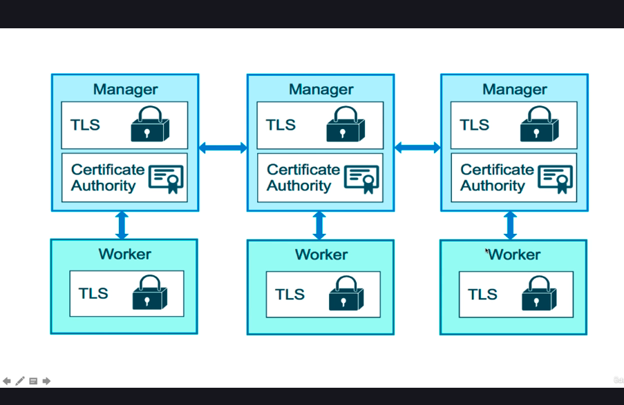

# Docker
### Quiz
    1. Which of the following answers is true about buildtime statements in Docker?
        a) They only effect how containers run
        b) They only effect files in the image or how the image is built
        c) They are always stored as meta data
        ans: B Correct. You could argue that how an image is built, is to affect how it will run, but you get the point here: Buildtime statements will do things during a docker build.
    2. Which of the following is true about overwrite statements?
        a) They add to any previous use.
        b) they only effect run time behaviour
        c) They replace any previous use
        ans: C
    3. Which type of statement is ENTRYPOINT?
        a) Buildtime
        b) Runtime
        c) Compile-time
        d) sleep time
        ans: B True. Docker adds the ENTRYPOINT to the metadata that goes along with the image, for it to be used on container start.
    4. How many ENTRYPOINT instructions in a Dockerfile are used?
        a) The first one
        b) All of them
        c) The last one
        ans: C True. Because ENTRYPOINT is an Overwrite statement. Only the last one in the Dockerfile is used.
    5. Which statement is preferred for starting long-lasting processes like web servers or databases?
        a) Entrypoint
        b) CMD
        c) RUN
        ans: B Default to using CMD for long running processes.
    6. When would you need to add a SHELL statement to a Dockerfile?
        a) when i want to install a new shell in the image
        b) when i want to change default shell on Linux for run statements
        c) when i want to switch from linux containers to windows containers
        d) when i want to change to distroless image
        option c: False. To create a Docker image that supports the Windows kernel, also called a “Windows Container”, you’d need to change the FROM statement to a Microsoft Windows base image.
        option B:  In the rare case you need to change from “sh” on Linux or “cmd” on Windows, SHELL is how you do it for affecting RUN, and sometimes CMD statements.
## Docker Compose
    We need docker compose to run to multiple containers, and sometimes containers needs depends on other container we could do this.
    How does it look?
        docker-compose.yml
        version: "3.1" #If no version is specified then v1 is assumed, Recommended v2 minimum
        services: # Containers same as docker run
            servicename: # friendly name this is also dns name inside network
                image: #optional if you use build
                command: #Optional, replace the default CMD specified by the image
                environment: #Optional, same as -e in docker run
                volumes: #Optional, same as -v in docker run
            volumes: # Optional, same as docker volume create
            network: # Optional, same as docker network create
    
    Example of Docker file with key value pair or hypen use
    wordpress:
        image: wordpress
        environment:
            WORDPRESS_DB_PASSWORD: password
            key: value
        volumes:
            - ./wordpress_data:/var/ww/html
        
        The environment i can write it different
        environment:
            - WORDPRESS_DB_PASSWORD=password
            - key=value
    Note: after implementation of v2 docker cli shifted from
        this docker-compose up to docker compose up
### Docker cli
    CLI Tools comes with docker for windows / mac, but needs to be downloaded for linux
    Not a production grade tool but suitable for local and test
    Two most common commands are:
        docker compose up # setup volumes/networks and start all containers
        docker compose down # stop all containers and remove cont/vol/net
        docker compose logs
        docker compose --help
        docker compose ps
        docker compose top
        docker compose -v (by default it is not removing volumes because always we want to persist data)
    
    If all your projects had a dockerfile and docker-compose.yml file then the developer on-boarding would be like:
        git clone
        docker compose up
### Using compose to build
    Compose can also build your custom images
    Will build them with docker compose up if not found in cache
    Also rebuild with docker compose build
### Quiz
    1. Which is the minimum recommended version for a docker-compose.yml file?
        a) 1
        b) 2
        c) 3.1
        ans: B Version 2 and above provide significantly more features then the old default version 1, and what we will be using as a default base for this course. Bonus Note: v2.x is actually better for local docker-compose use, and v3.x is better for use in server clusters (Swarm and Kubernetes)
    2. Which of the following does "docker-compose up" automatically create, even if not manually specified in the compose file?
        a) network
        b) Registry
        c) Backup
        ans: A The bridge network is created at runtime by default so the containers can communicate with one another across it.
    3. What is the 'build context' in a compose file supposed to do?
        a) The build has to occur before run command
        b) The image in reference has to exist in a docker hub repo before being run
        c) docker-compose should built an image from the context of the most recent image built in previous compose file
        d) It is meant to specify where the dockerfile of the image is supposed to build from
        ans: D The "." indicates the dockerfile exists in the same directory as the compose file.
    4. Usernames for a database, when placed in a compose file of a specific service, would best fit placed under which of the following keys?
        a) image
        b) environment
        c) identity
        d) volumes
        ans: A
    5. Where does compose derive a DNS name from?
        a) service name
        b) image names
        c) volume names
        d) reddit usernames
        ans: A DNS names (set as aliases) for containers in a compose file come from the service name declared in the .yml
    6. The "ports:" key in a compose file does the same thing as the EXPOSE stanza in a Dockerfile.
        ans: False The "ports:" key publishes the particular service on whatever port you specify, and is the docker run equivalent to the -p flag.
### Containers Everwhere = new problems
    How do we automate container lifecycle?
    How can we easily scale in/out/up/down?
    How do we ensure our containers are re-created if they fail?
    How can we replace containers without downtime(blue/green deployments)?
    How can we control/track where containers get started?
    How can we create cross-node virtual networks?
    How can we ensure only trusted servers run our containers?
    How can we store secrets, keys, passwords and get them to the right container(and only that container)?
    We can solve all this problems using Swarm mode
## Swarm mode built in orchestration
    It is new feature added in 2016
    Swarm is actually a server clustering solution that brings together different operating systems or nodes or hosts, into a single managable unit that you can then orchestrate the lifecycle
    Swarm Mode is a clustering solution built inside Docker
    Added in 1.12 (summer 2016) via swarmkit toolkit
    Enhanced in 1.13(Jan 2017) via stacks and secrets
    Not enabled by default, new commands once enabled
        docker swarm
        docker node
        docker service
        docker stack
        docker secret
    Architecture of how swarm works 

.png>)

.png>)

        
